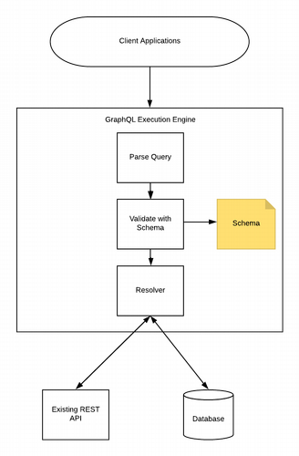

# Introduction
>GraphQL is an open-source data query and manipulation language for APIs, and a runtime for fulfilling queries with existing data. GraphQL was developed internally by Facebook in 2012 before being publicly released in 2015.

# what is GraphQL
> GraphQL is a query language for your API, and a server-side runtime for executing queries by using a type system you define for your data. GraphQL isn't tied to any specific database or storage engine and is instead backed by your existing code and data.

A GraphQL service is created by defining types and fields on those types, then providing functions for each field on each type. For example, a GraphQL service that tells us who the logged in user is (me) as well as that user's name might look something like this.

>type Query {
  me: User
}
>type User {
  id: ID
  name: String
}

### Why GraphQL
RESTful APIs follow clear and well-structured resource-oriented approach. However, when the data gets more complex, the routes get longer. Sometimes it is not possible to fetch data with a single request. This is where GraphQL comes handy. GraphQL structures data in the form of a graph with its powerful query syntax for traversing, retrieving, and modifying data. 

###GraphQL Schema

A GraphQL schema is at the core of any GraphQL server implementation. It describes the functionality available to the client applications that connect to it. We can use any programming language to create a GraphQL schema and build an interface around it.

The GraphQL runtime defines a generic graph-based schema to publish the capabilities of the data service it represents. Client applications can query the schema within its capabilities. This approach decouples clients from servers and allows both to evolve and scale independently.

To know More  *[GraphQL Schema Guide](https://graphql.org/learn/schema/)*

###### Type system 
 GraphQL query language is basically about selecting fields on objects. So, for example, in the following query:

>{
  hero {
    name
    appearsIn
  }
}
1. We start with a special "root" object
2. We select the hero field on that
3. For the object returned by hero, we select the name and appearsIn fields

###### Object types and fields
The most basic components of a GraphQL schema are object types, which just represent a kind of object you can fetch from your service, and what fields it has. In the GraphQL schema language, we might represent it like this:

>type Character {
  name: String!
  appearsIn: [Episode!]!
}

### Resolver
Resolver is a collection of functions that generate response for a GraphQL query. In simple terms, a resolver acts as a GraphQL query handler. Every resolver function in a GraphQL schema accepts four positional arguments as given below −
>fieldName:(root, args, context, info) => { result }
1. Query Type-

A GraphQL query is for fetching data and compares to the GET verb in REST-based APIs.
In order to define what queries are possible on a server, the Query type is used within the SDL. The Query type is one of many root-level types which defines functionality (it doesn't actually trigger a query) for clients and acts as an entry-point to other more specific types within the schema.

			Ex:type Query {
			 getBooks: [Book]
			 getAuthors: [Author]
			}

2. Mutation type-

Mutations are operations sent to the server to create, update or delete data. These are comparable to the PUT, POST, PATCH and DELETE verbs on REST-based APIs.
Much like how the Query type defines the entry-points for data-fetching operations on a GraphQL server, the root-level Mutation type specifies the entry points for data-manipulation operations

3. Subscription type-

Adding GraphQL subscriptions to your GraphQL schema is simple, since Subscription is just another GraphQL operation type like Query and Mutation.

You specify operation type, then the operation name and you can customize the publication data with a selection set and arguments.

You need to create a root schema definition and a root resolver for your  Subscription root, just like with Query and Mutation

			Ex:type Comment {
			 id: String
			 content: String
			}

			type Subscription {
			 commentAdded(repoFullName: String!): Comment
			}

			schema {
			 query: Query
			 mutation: Mutation
			 subscription: Subscription
			}
Create a resolver just like queries and mutations, but instead of function, pass an Object with subscribe field and a subscription resolver method.